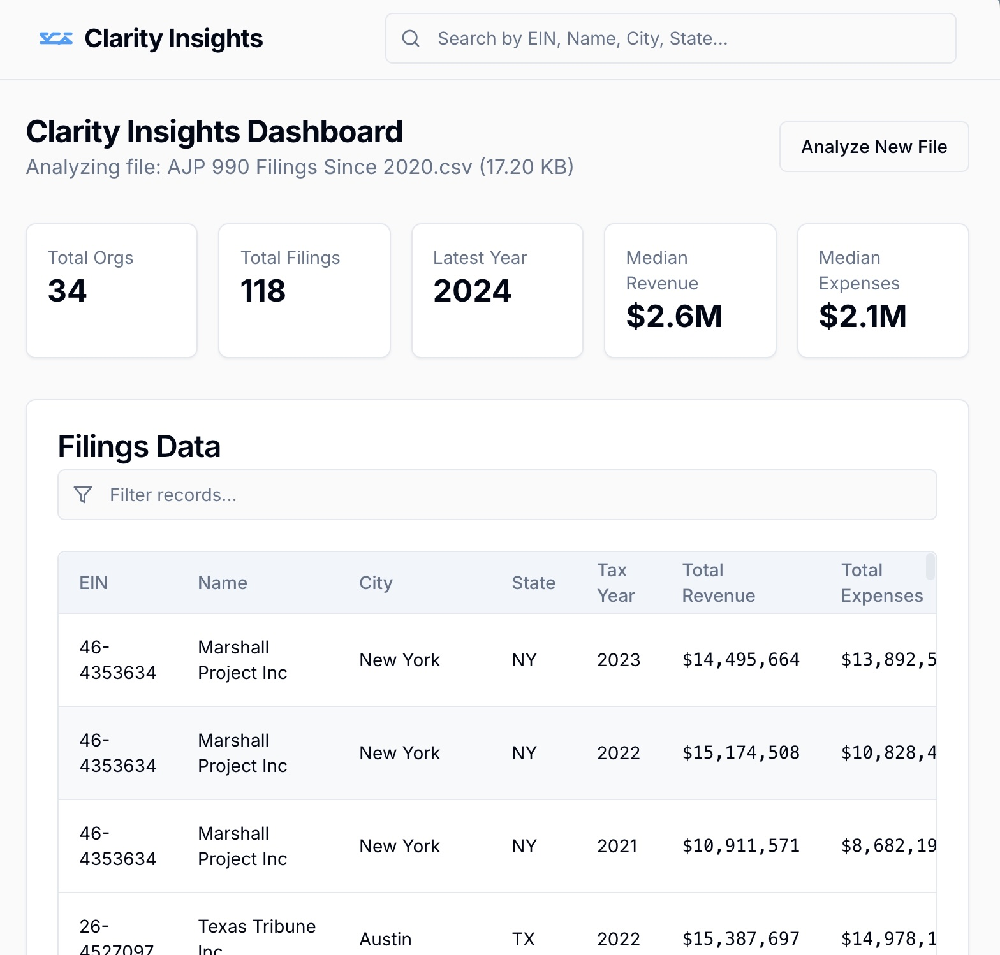

# Nonprofit Evaluator

This was inspired by a colleague who needed to grab lots of information from 990 forms on a regular basis-- a tedious task. Another colleague dreamt of a dashboard that would visualize the data in the way she needed. ProPublica's [nonprofit explorer](https://projects.propublica.org/nonprofits/) has a [convenient API](https://projects.propublica.org/nonprofits/api) with no key or authentication required (just don't DDoS our friends there!).

This could be used to look at funding for any nonprofit or determine patterns in a group of them.

### Where I started

I envisioned this as two separate-but-related vibe-coding projects:

- A script to grab the information
- A tool to visualize the information

*Why not do both in one?* Because many vibe-coding struggle with "cross-origin requests", a.k.a. making live data requests to other sites. This data doesn't update often, so a static data set works here.

### Part 1: Grab the initial data

1. I opened ChatGPT and asked:

> Write me a Google Apps Script that takes in a column value, uses that as the EIN, and queries the ProPublica Nonprofit Explorer API to get the organization name, latest 990 tax year and total contributions from that form.

It made me [this script](script_v1.txt) on the first try.

2. I created a new Google Sheet and went to `Extensions > Apps Script`, and pasted the script into the block.

3. I put a sample nonprofit EIN number in Column A (for instance, `53-0196605` for the Red Cross).

| EIN        | Name | Tax Year | Total Contributions |
|------------|------|----------|---------------------|
| 53-0196605 |      |          |                     |

4. I refreshed the sheet, and thanks to the script, it showed me a new "990 Tools" menu. I went to `990 Tools > Fill from EIN`

5. The first time I ran it, Google asked for permissions, and I granted them. I then had to re-run it. And *poof* it populated!

| EIN        | Name                        | Tax Year | Total Contributions |
|------------|-----------------------------|----------|---------------------|
| 53-0196605 | American National Red Cross | 2023     | 23444875            |

This was a good start.

### Part 2: Grab more data

I knew that the API had lots of valuable information, and wanted to get more of the data and historical filings. So I went back to ChatGPT:

> Help me explore what other fields are in ProPublica's 990 Explorer and could be added as columns into this script and spreadsheet.

After it suggested some helpful ideas:

> Ok, let's add city, state, and ruling_date from Organization, and from filings_with_data, let's add total_revenue, total_expenses, assets_end, as well as compnsatncurrofcr (compensation of current officer) and othrsalwages (other salary and wages). I'd also like to include the pdf_url when available.
>
>
> Let's also expand the script to enable us to see all filings_with_data since 2020.

This produced a [near-flawless 350-line script](script_v2.txt), which I swapped in to replace v1.

I put in The Texas Tribune's EIN, and got this:

| EIN       | Name             | City   | State | Tax Year | Total Contributions | Total Revenue | Total Expenses | Assets End | Comp Current Officers | Other Salary & Wages | PDF URL |
|-----------|------------------|--------|-------|----------|----------------------|---------------|----------------|------------|-----------------------|----------------------|---------|
| 264527097 | Texas Tribune Inc | Austin | TX    | 2023     | 13487481          | 15082016    | 15702362     | 12592886 | 564006               | 9868484            |         |

This was cool, but even better: the script had added another menu item to the 990 Tools: "Append Fillings Since 2020 to new sheet". I clicked that and got a new tab:

| EIN       | Name              | City   | State | Tax Year | Total Contributions | Total Revenue | Total Expenses | Assets End | Comp Current Officers | Other Salary & Wages | PDF URL |
|-----------|-------------------|--------|-------|----------|----------------------|---------------|----------------|------------|-----------------------|----------------------|---------|
| 264527097 | Texas Tribune Inc | Austin | TX    | 2020     | 11700733            | 12467958      | 10739360       | 12456170   | 778852                | 5928509              | https://projects.propublica.org/nonprofits/download-filing?path=download990pdf_10_2022_prefixes_26-27%2F264527097_202012_990_2022102520548356.pdf |
| 264527097 | Texas Tribune Inc | Austin | TX    | 2021     | 9310113             | 10185850      | 11737359       | 11022955   | 817557                | 7125997              | https://projects.propublica.org/nonprofits/download-filing?path=download990pdf_05_2023_prefixes_26-27%2F264527097_202112_990_2023051021200080.pdf |
| 264527097 | Texas Tribune Inc | Austin | TX    | 2022     | 13197536            | 15387697      | 14978164       | 13437847   | 566251                | 9042087              | https://projects.propublica.org/nonprofits/download-filing?path=download990pdf_01_2024_prefixes_26-26%2F264527097_202212_990_2024011022208573.pdf |
| 264527097 | Texas Tribune Inc | Austin | TX    | 2023     | 13487481            | 15082016      | 15702362       | 12592886   | 564006                | 9868484              |         |

Four years of data. Brilliant!

It was time to fill this dataset out: I decided to ask ChatGPT for the EIN numbers of all American Journalism Project newsrooms, and it found many of them. I put them into the sheet and got [this dataset](https://docs.google.com/spreadsheets/d/1yasFjEcVpA8tm8e9LVN09KYbA96Pwx33kT7cHxlZsrs/edit?gid=868981610#gid=868981610).

**Stating the obvious**: You need to double-check that you have a complete and accurate data set. But asking an LLM for a script or formula is a much easier way to do this at scale: once you've ensured the script is working, you are into old-fashioned, deterministic code with 100% accuracy.

### Part 3: Visualize the data

I went to [Firebase Studio](https://firebase.studio) and put this in the prompt:

> A dashboard that can intake, filter, analyze and visualize patterns and outliers in a dataset of nonprofit financial records data.

I clicked the "Enhance" button and it gave me a new and improved version:

> A professional dashboard application for nonprofit financial records to intake, filter, analyze, and visualize patterns and outliers. Key features include secure data upload, interactive search, filtering and sorting, automated pattern and outlier detection, and customizable data visualization charts. Use a professional blue and green color scheme with clean white backgrounds.

Once it built the application, it gave me an error on first upload. I realized it needed more detail:

> I'd like to upload a CSV that has historical data since 2020 for dozens of nonprofit newsrooms. It has the following columns. Edit the application to handle and work with these columns and this purpose.

It gave me some very ugly and broken dashboards! I kept asking for more but I couldn't get it to work. Firebase was getting increasingly apologetic about its failures. I walked away.

Hours later, I came back and started telling it "Let's start from scratch..." but didn't know where to start. Then I realized I had all the context I needed...from Part 1.

I returned to ChatGPT and said:

> I have now downloaded this data and have the attached CSV. I'm trying to build a dashboard that allows me to query, filter, summarize, create charts, and detect patterns and outliers in this data. Help me craft a prompt for an app builder, such as Firebase Studio, to create such a dashboard.

It gave me a [much more detailed prompt](firebase_prompt.md) than I would have ever constructed. I told Firebase "let's start over here" and pasted it in.

Great success!

[Check out the tool yourself](https://9000-firebase-studio-1756484709243.cluster-f73ibkkuije66wssuontdtbx6q.cloudworkstations.dev) after you download 990 data of your choice.

While some of this isn't much more than you'd get from a good spreadsheet or Airtable, it leads to some customizable visualizations and a button that asks AI to detect patterns and outliers.

What else could we ask it to do, and what nonprofits' data sets would be most interesting to try?