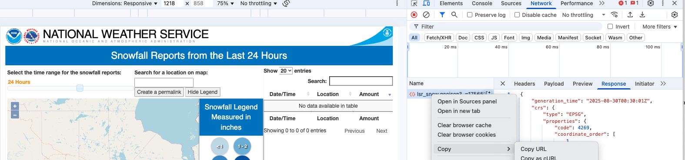
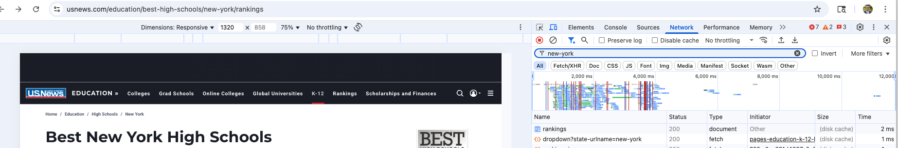
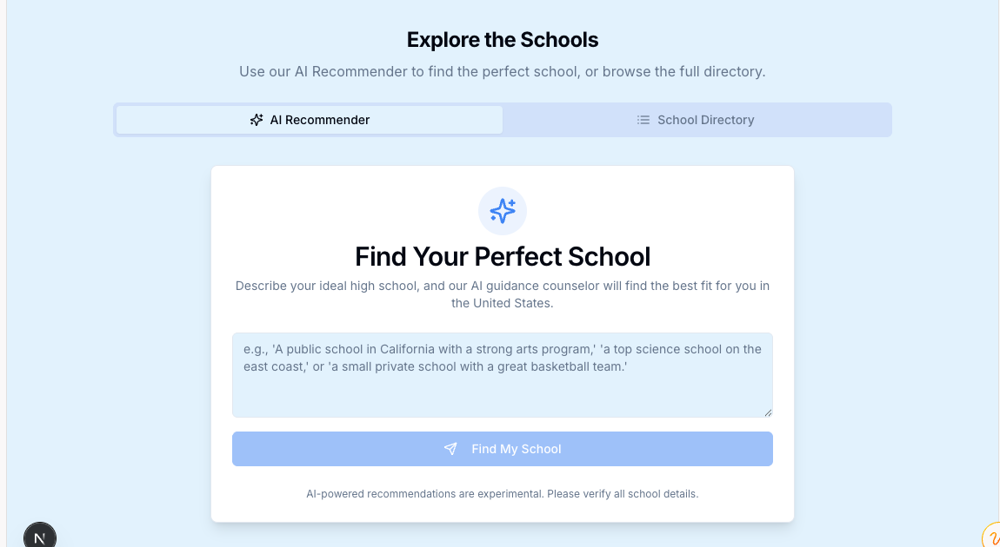
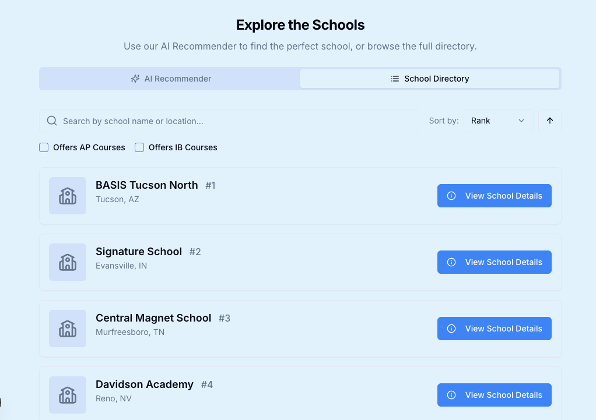
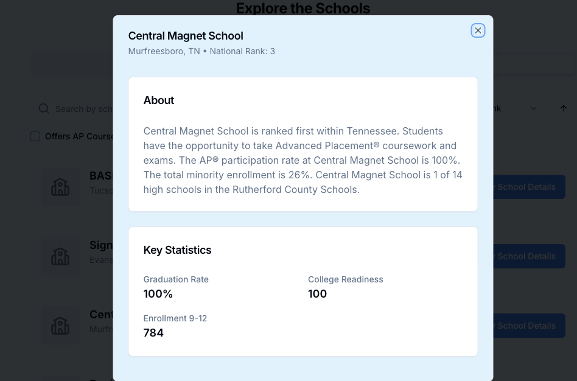
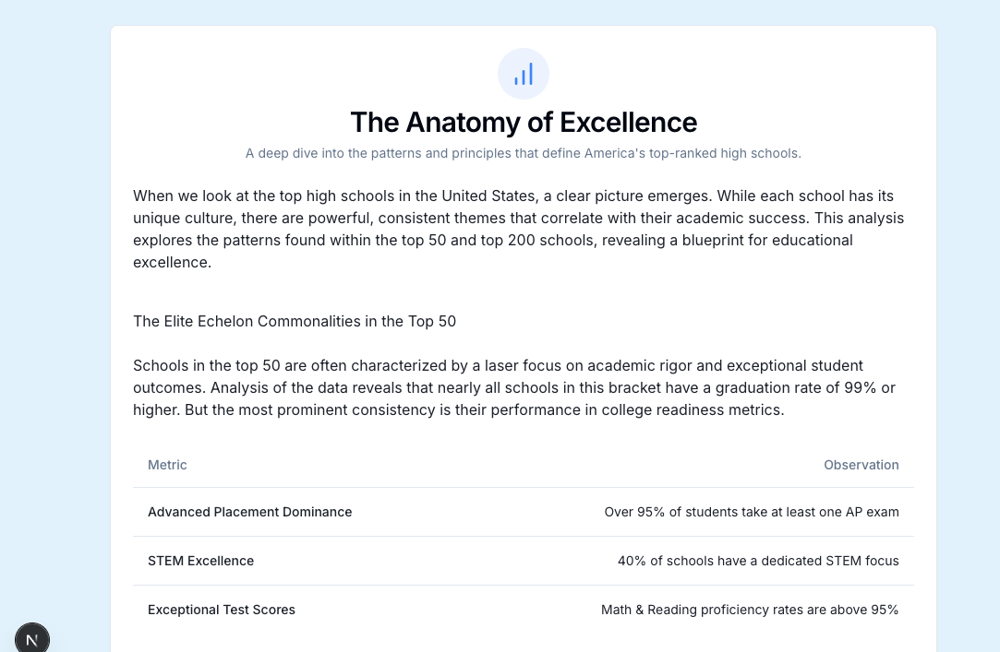

# Top High Schools Interactive

This was an idea to show off how you can create new and unique experiences, doing reporting like you may already do, using LLMs and Vibe Coding.

All states have top schools in the country, so using some methods you may know about, plus some vibe coding, you can build this experience. At first I wanted to make an experience for the top high schools in a state (I live in New York), but then looked a little further into this. 

## Resources that inspire this that are worth knowing about

The main one I used to get this feed is this one below...
* **https://2023.srccon.org/schedule/#_session-scraping-dev-tools** - I missed this one at SRCCON 2023, but I do come back to it a lot, how to find hidden APIs on the internet. I'm sure there are plenty of good resources on this as well. 

Here is an example of how to get this kind of data... then I'll show you how to do it on the US News page...

### Weather cURL
**`https://www.weather.gov/source/crh/snowmap.html`**. 
> Inspect and use the Network requests to find the feed. This one I copied in as a cURL - and if you were not good at cURL or wanted an LLM to do it for you you could give this cURL to an LLM and ask it to write it in your favorite language (JavaScript, Python, etc.)

```
curl 'https://www.weather.gov/source/crh/lsr_snow.geojson?_=1756513846876' \
  -H 'accept: application/json, text/javascript, */*; q=0.01' \
  -H 'accept-language: en-US,en;q=0.9' \
  -b '__utmc=261899531; __utmz=261899531.1755792856.1.1.utmcsr=(direct)|utmccn=(direct)|utmcmd=(none); myForecast=29.9511%2C-90.0715; myForecastess=29.9511%2C-90.0715; _ga_8BR32RPT9V=GS2.1.s1755795534$o2$g0$t1755795542$j52$l0$h0; _ga=GA1.1.765917822.1750641874; CFIWebMonSession=%7B%22GUID%22%3A%22b00e88f4-f495-6c72-ddfe-755792937219%22%2C%22EmailPhone%22%3A%22%22%2C%22HttpReferer%22%3A%22https%3A//forecast.weather.gov/%22%2C%22PageViews%22%3A5%2C%22CurrentRuleId%22%3Anull%2C%22CurrentPType%22%3A0%2C%22Activity%22%3A%22Browse%22%2C%22SessionStart%22%3A1755792937218%2C%22UnloadDate%22%3A1755800358862%2C%22WindowCount%22%3A0%2C%22LastPageStayTime%22%3A362060%2C%22AcceptOrDecline%22%3A%7B%7D%2C%22FirstBrowsePage%22%3A%22https%3A//www.weather.gov/%22%2C%22FirstBrowseTime%22%3A1755799994697%2C%22FinallyLeaveTime%22%3A1755799996802%2C%22FinallyBrowsePage%22%3A%22https%3A//www.weather.gov/vef/%22%2C%22SiteReferrer%22%3A%22%22%2C%22LastPopUpPage%22%3Anull%2C%22TimeSpentonSite%22%3A0%2C%22GoogleAnalyticsValue%22%3Anull%2C%22Dimension%22%3Anull%2C%22AdditionalAttributes%22%3A%7B%7D%2C%22ClickTracker%22%3A%22%22%2C%22PageIndex%22%3A0%7D; _ga_CSLL4ZEK4L=GS2.1.s1755799932$o5$g1$t1755800358$j60$l0$h0; _ga_736JJ6NL0V=GS2.1.s1755799932$o3$g1$t1755800358$j60$l0$h0; __utma=261899531.765917822.1750641874.1756397387.1756513847.3; __utmt_GSA_CP=1; __utmb=261899531.1.10.1756513847' \
  -H 'dnt: 1' \
  -H 'priority: u=1, i' \
  -H 'sec-ch-ua: "Not;A=Brand";v="99", "Google Chrome";v="139", "Chromium";v="139"' \
  -H 'sec-ch-ua-mobile: ?1' \
  -H 'sec-ch-ua-platform: "Android"' \
  -H 'sec-fetch-dest: empty' \
  -H 'sec-fetch-mode: cors' \
  -H 'sec-fetch-site: same-origin' \
  -H 'user-agent: Mozilla/5.0 (Linux; Android 6.0; Nexus 5 Build/MRA58N) AppleWebKit/537.36 (KHTML, like Gecko) Chrome/139.0.0.0 Mobile Safari/537.36' \
  -H 'x-requested-with: XMLHttpRequest'
```

## US News Data
So using this, I have the page I was on and I can look for the underlying data. I already know the URL has `new-york` in it, so I searhc the Network pane for that.


* **https://www.usnews.com/education/best-high-schools/new-york/rankings** - This is the source data. Change the state name based on their rules ('new-hampshire', 'south-dakota', 'mississippi') and you can generate data... You can see the structure of it here, see the hidden api?!

```
curl 'https://www.usnews.com/education/best-high-schools/api/districts/dropdown?state-urlname=new-york' \
  -H 'sec-ch-ua-platform: "Android"' \
  -H 'Referer: https://www.usnews.com/' \
  -H 'User-Agent: Mozilla/5.0 (Linux; Android 6.0; Nexus 5 Build/MRA58N) AppleWebKit/537.36 (KHTML, like Gecko) Chrome/139.0.0.0 Mobile Safari/537.36' \
  -H 'sec-ch-ua: "Not;A=Brand";v="99", "Google Chrome";v="139", "Chromium";v="139"' \
  -H 'DNT: 1' \
  -H 'sec-ch-ua-mobile: ?1'
```

* With that then I was able to make this URL
```https://www.usnews.com/education/best-high-schools/search?format=json&state-urlname=new-york&page=1```
This powers the top items in for New York in the feed... and see how there's page 1? I can paginate through and just add more data to make my own file. _One great way, not with this page, is to assume there's more than 1 page and grab as much data as you can._
* IF you're a national outlet, just remove the *`&state-urlname=new-york`* you have all the US 🇺🇸 I only found this out after trying it. Sometimes when you remove parameters that will bring in new layers.
* *Which is actually the next thing I did was paginate through the top 10 and pull the top 200 schools which is what you'll see today!* (How I did this was very hack-y, because originally I was going to write a scraper to do it, but this page proved to be difficult to automate and scrape. However, you can **GET** the URL in your browser without an issue. So I loaded up 10, found the results list and created the `file.json`.)

## Think about how you want your experience
Using Firebase Studio I set up a project with all this information and gave it some direction. 

1. At first I thought, maybe it could **make me a recommendation tool** where I put some infomration in. This it _evenutally_ got right, but not without a lot of tweaking. 


2. Then I said maybe it can **generate a table** of all the top schools - *this worked out just fine*. One downside at one point it tried to make up images for each school that weren't in the JSON, that was not a good choice.

One thing it did well was make the "more infomration" buttons where it uses the actual data from the file.json to give you more facts about the school.


3. I thought maybe I can get it to **make a map and this did NOT work**. You're probably thinking "why not?!" and it's because especially for mapping, if there is not a lattiude and longitude in the data, maps will not work out great. Since I was going off data provided from the API, it only gave city, state as a data point. (example below)
```"school": {
            "location": "Tucson, AZ",
            "profile_url": "https://www.usnews.com/education/best-high-schools/arizona/districts/basis-charter-schools-inc/basis-tucson-north-140137",
            "district_page_url": "https://www.usnews.com/education/best-high-schools/arizona/districts/basis-charter-schools-inc-100663",
            "district": "BASIS Charter Schools Inc.",
            "school_id": 140137
        },
```
_If you wanted_ to make a map, I think the best way would be to ask the LLM to go find the addresses of every school in every location and then try to map it that way, but that still may not be as good as it should be.
4. I tried asking for a heatmap of the US, counting map, all of them failed miserably. I got terrible looking images that were not maps at all.

5. Then I asked for a brief article writing about __"describing the consistencies with the top 50 high schools and then broadly around the top 200 and what correlate to their sucess"__. The article reads very much like an LLM wrote it after many tries to reformat it. Does it give some useful information? Maybe.



## What you should learn
- Center on a problem you want to solve. 
- Look at pages on the internet for stories and look deeper to find their data sources.
- Think about interactivity and the types that will help tell your story.

## What you can do with this next?
* There are endpoints to find the top colleges, business schools, law schools, etc. Oh look I shared a few!
```
https://www.usnews.com/best-colleges/api/search?format=json&schoolType=regional-colleges-north&_sort=rank&_sortDirection=asc&
https://www.usnews.com/best-colleges/api/search?format=json&schoolType=regional-colleges-south&_sort=rank&_sortDirection=asc&
```
Look if I just take out schoolType... I get the top schools 🤓
```
https://www.usnews.com/best-colleges/api/search?format=json&_sort=rank&_sortDirection=asc
```
If you want to nerd out, we know there's 183 pages of top schools
```
    "page": 1,
    "total_pages": 183,
    "hasNextPage": 182,
    "total_count": 1827,
    "items": [
```
if add page one... it works too!
`https://www.usnews.com/best-colleges/api/search?format=json&_sort=rank&_sortDirection=asc&page=1`

* Go build your own thing 🙂
* Say you wanted to build your own top schools in the region for your high schoolers, or top schools by major? You can go do that now!