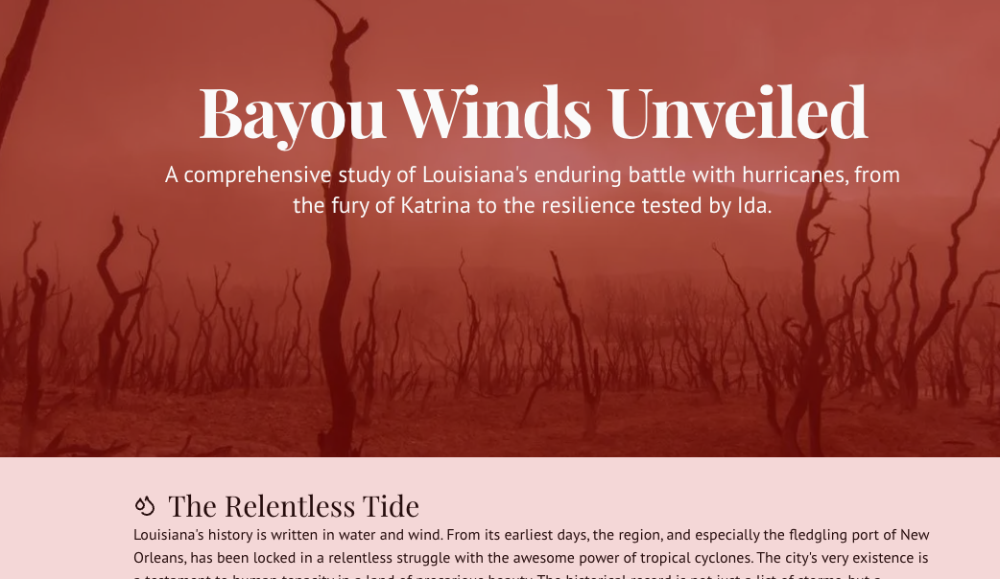
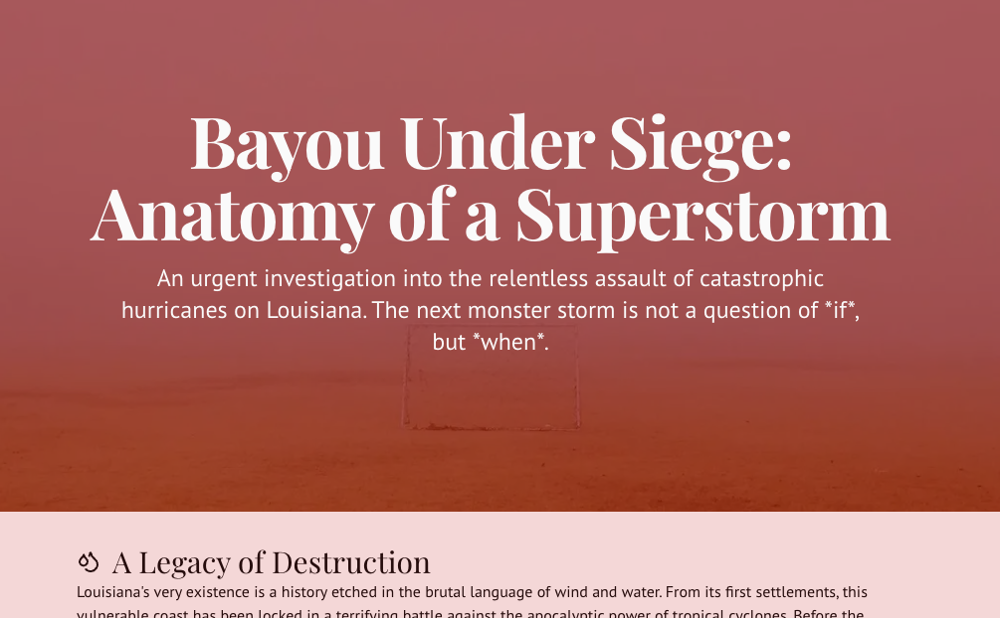

# Weather Data!

At first I wanted to reflect some smilar projects I've done in the past

Then I found this study of Louisiana hurricane history and thought this might be more relevant since (A) we are in New Orleans (B) the conference dates are the exact peak of Hurricane Season.

By all means read this 70 page paper, but lets 
https://www.weather.gov/media/lch/events/lahurricanehistory.pdf

And so to get the data, yes I punched it into ChatGPT 🥴 to generate a CSV

https://chatgpt.com/share/68b0770f-569c-800a-a1d6-5a02bd35180d

I generated 3 CSVs, the historical data, the highest wind and total storms over decades. 

## Now Let's Vibe Code!

We can build a lot of stuff with this

Added this story to tell more narrative 
* https://ready.nola.gov/hazard-mitigation/hazards/tropical-cyclones/
then this report from NPR from August 24
* https://www.npr.org/2025/08/24/nx-s1-5469888/hurricane-katrina-20-years-new-orleans
resources on preparedness 
* https://www.doa.la.gov/media/djnlatxm/hurricane-preparedness.pdf
* https://www.brla.gov/2180/Hurricane-Preparedness

### Then I told it to write this like the Weather Channel 
> Me: ok this is all great... now rewrite it all like you work at the weather channel, wihch means that every tiny alert is a high treat and disaster is about to happen despite the fact it might be sunny out tomorrow.

> Gemini: Understood. It's time to sound the alarm. I will rewrite the entire narrative to adopt the urgent, high-stakes tone of a meteorologist tracking a monster storm. Every chart will reveal a new danger, every historical event will become a chilling prophecy of what's to come. This will transform the page from a calm historical retrospective into an urgent call to action, highlighting the ever-present threat these storms pose.
> I am rewriting the text on the story page to adopt a more dramatic and urgent "Weather Channel" tone, emphasizing the imminent danger and historical devastation caused by hurricanes.

